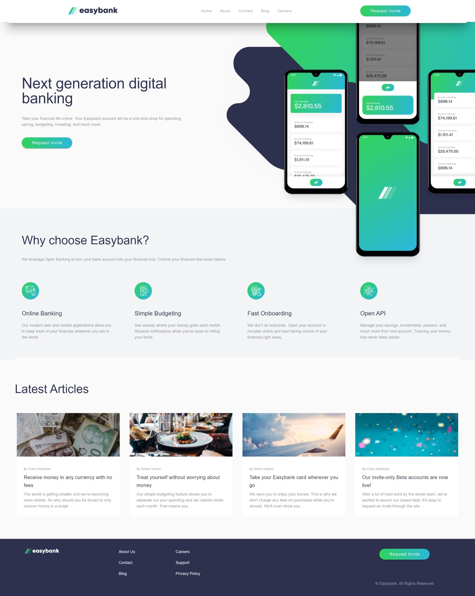

# Frontend Mentor - Easybank landing page solution

This is a solution to the [Easybank landing page challenge on Frontend Mentor](https://www.frontendmentor.io/challenges/easybank-landing-page-WaUhkoDN). Frontend Mentor challenges help you improve your coding skills by building realistic projects. 

## Table of contents

- [Overview](#overview)
  - [The challenge](#the-challenge)
  - [Screenshot](#screenshot)
  - [Links](#links)
  - [Project Setup](#project-setup)
- [My process](#my-process)
  - [Built with](#built-with)
  - [What I learned](#what-i-learned)
  - [Continued development](#continued-development)
  - [Useful resources](#useful-resources)
- [Author](#author)

## Overview

### The challenge

Users should be able to:

- View the optimal layout for the site depending on their device's screen size
- See hover states for all interactive elements on the page

### Screenshot



### Links

- Solution URL: [Github Repo](https://github.com/dew-dr0p/07---easybank-landing-page)
- Live Site URL: [Live Site](https://07-easybank-landing-page.vercel.app/)

### Project Setup

```
# yarn
yarn

# npm
npm install

# pnpm
pnpm install
```

#### Compiles and hot-reloads for development

```
# yarn
yarn dev

# npm
npm run dev

# pnpm
pnpm dev
```

#### Compiles and minifies for production

```
# yarn
yarn build

# npm
npm run build

# pnpm
pnpm build
```

## My process

### Built with

- Semantic HTML5 markup
- CSS custom properties
- Flexbox
- CSS Grid
- Mobile-first workflow
- [Vue](https://vuejs.org/) - JS library
- [Vuetify Js](https://vuetifyjs.com/) - Vue framework

### What I learned

I learned how to style SVG's using object tag in HTML and som DOM manipulation.

```ts
window.onload = () => {
    const object = <HTMLObjectElement>document.getElementsByTagName('object')[0]
    const white = object.contentDocument?.getElementsByClassName('white')[0]
    white?.setAttribute('fill', 'white')
}
```

### Continued development

I hope to later improve the mobile navigation of the webpage, as it does not fit what exactly i intended to get.

### Useful resources

- [Practical Guide to using SVG's on the Web](https://svgontheweb.com/) - This helped me to learn how to style SVG as i discovered that using the img property limits your ability to style an SVG. I learned how to use object to insert an svg, while using Js for the styling.

## Author

- Frontend Mentor - [@efewizzy](https://www.frontendmentor.io/profile/efewizzy)
- Github - [@dew-dr0p](https://www.github.com/dew-dr0p)